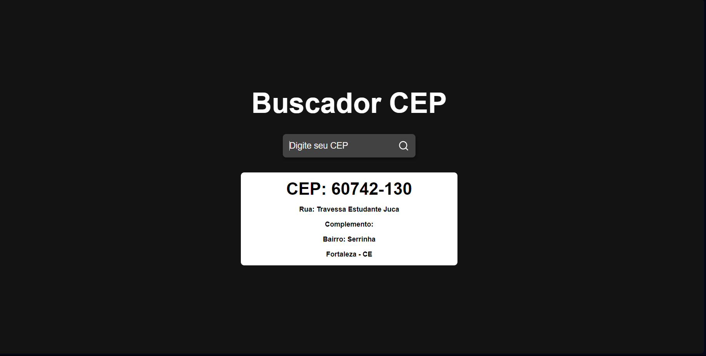

# Buscador de Endereço por CEP 🗺️



* <a href="https://buscador-cep-neon.vercel.app">Acesse aqui.</a>

## 💻 O Projeto

O Buscador de endereço por CEP é uma página onde usuário digita seu CEP e o sistema retorna os dados de endereço do CEP, como rua, bairro, cidade e estado, através da API <a href="https://viacep.com.br">Via CEP</a>. Feito com base na video-aula encontrada <a href="https://www.youtube.com/watch?v=oy4cbqE1_qc">aqui</a>. Nesse projeto vi os conhecimentos:
* Princípios de ReactJS
* ReactDOM
* Uso da lib React Icons
* useState
* Assincronismo 
* Consumo de API

## ⚡ Como rodar

Para rodar o projeto direto da sua máquina:
- Baixe o repositório, ou clone com a URL disponível aqui, com o comando
```
git clone https://github.com/lucyanovidio/buscador-cep.git
```
- Instale o <a href="https://nodejs.org/">Node.js</a>.
- Entre no diretório deste projeto e instale as dependências executando:
```
npm install
```
- Rode o projeto:
```
npm start
```

## 🛠 Tecnologias

<div>
    
    
    
    
</div>
<br>
